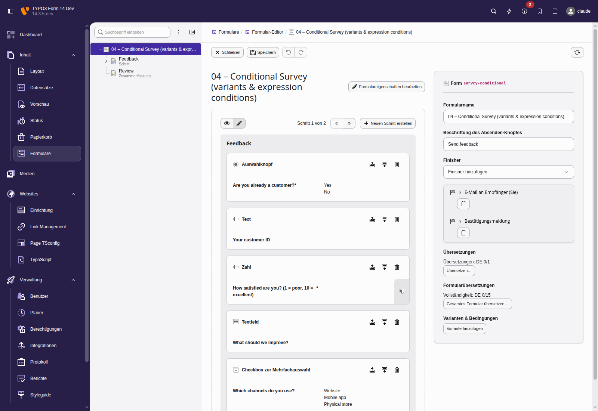
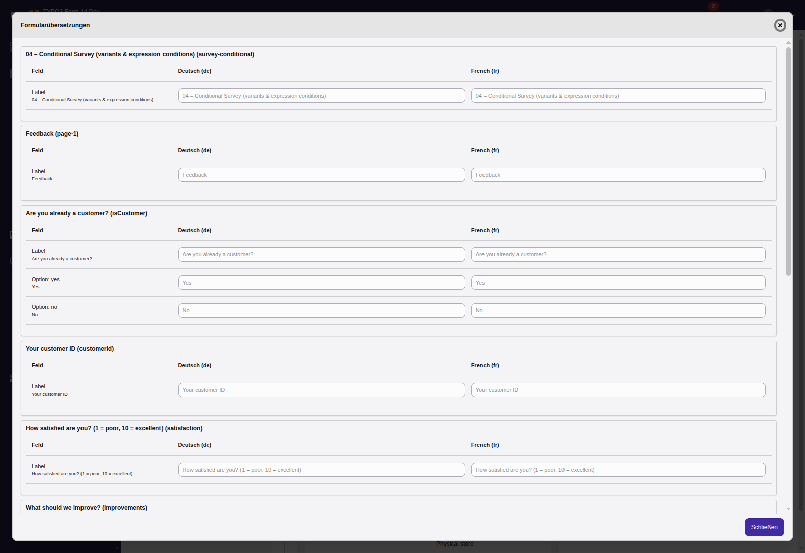
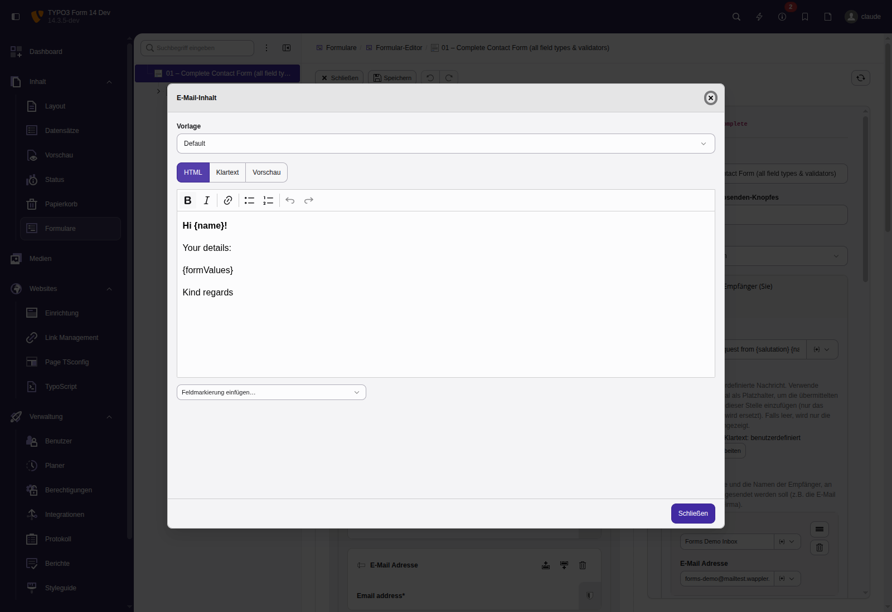
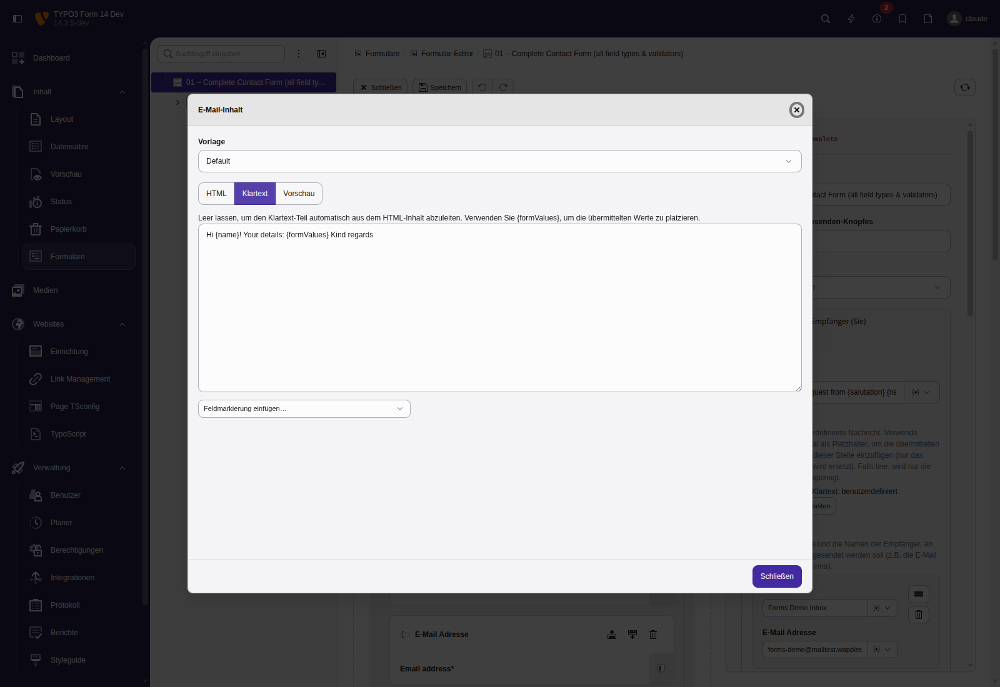
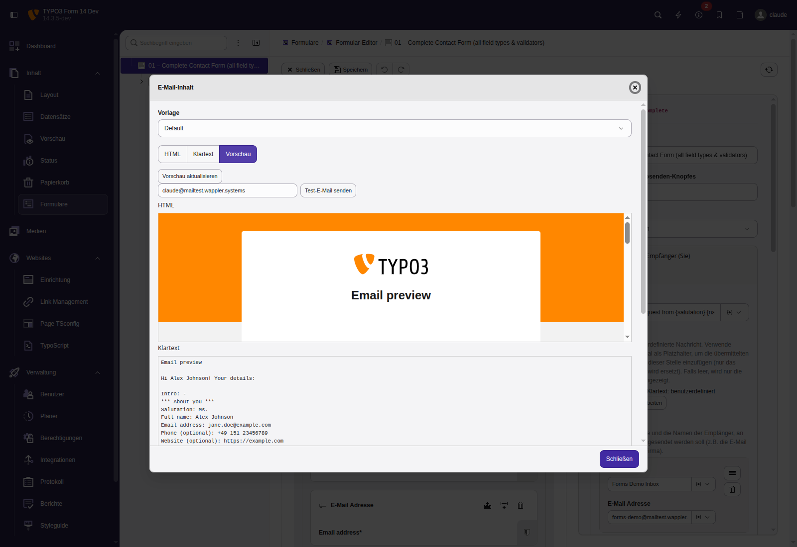
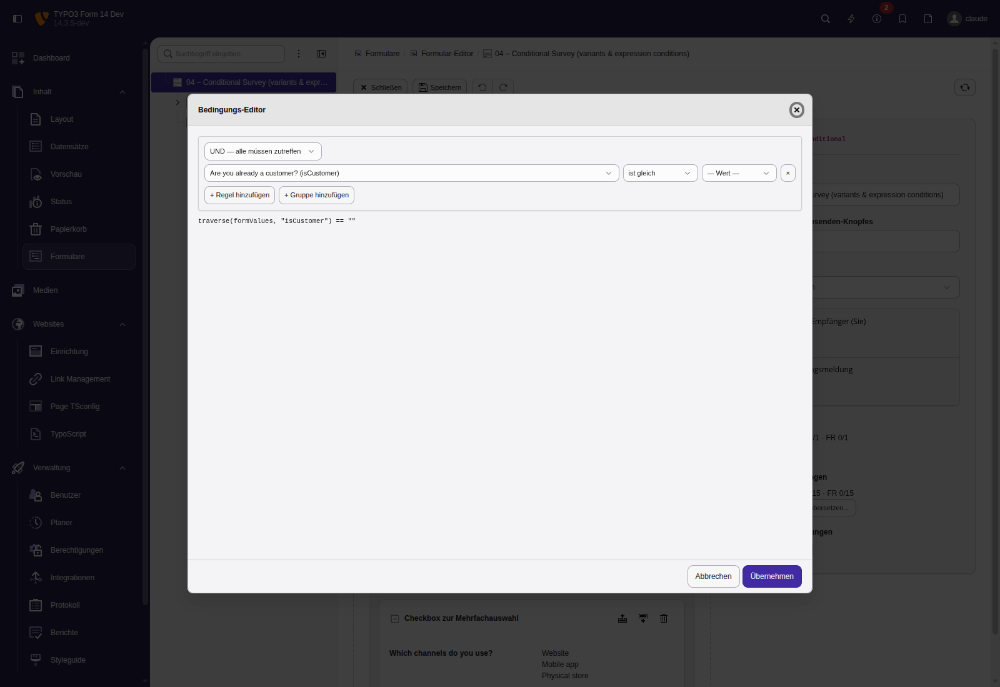

# wapplersystems/form

A hard fork of the TYPO3 system extension `form` — the read-only subtree split at
<https://github.com/TYPO3-CMS/form>, itself derived from `typo3/sysext/form/` in
<https://github.com/TYPO3/typo3>.

It is installed via Composer as `wapplersystems/form` and **transparently replaces
`typo3/cms-form`** through Composer's `replace` mechanism. The Composer package name and
the TYPO3 extension key on disk are deliberately different (`wapplersystems/form` vs.
`form`) so the extension stays a drop-in for `EXT:form` — everything that references
`\TYPO3\CMS\Form\…`, the YAML mixins, the form editor JavaScript, the Fluid template
paths and the FAL config keeps working without changes.

Every addition is backwards compatible: existing forms keep working and features degrade
gracefully (e.g. without JavaScript, or for forms that don't use them).

## Why fork?

The TYPO3 core `form` sysext is intentionally minimal in places where editor workflows
benefit from more depth:

1. **More events** — make finisher pipelines, variant evaluation and form rendering
   pluggable from outside via PSR-14 events instead of class extension.
2. **Backend editor parity** — features that exist today only via YAML hand-editing
   (variants/conditions, complex validators, finisher options, translations) become
   editable in the form editor.
3. **Cross-field validators** — validators that need more than a single field's value
   (entropy/spam filtering across all submitted text, conditional `required`, sums of
   numeric fields, etc.).
4. **Visual variants/conditions editor** — so integrators express conditional behavior
   without writing YAML.
5. **Consolidate `wapplersystems/form_extended`** — the patches and additions that lived
   in `form_extended` (multi-upload, sender-address config in site settings,
   country/date/time fields, custom finishers) have been absorbed into this fork. The
   migration is complete: `composer.json` now declares
   `"wapplersystems/form_extended": "self.version"` in its `replace` block, so packages
   still requiring `form_extended` stay satisfied and a **parallel installation is
   impossible** — `form_extended`'s `FormEditorController` XCLASS would otherwise displace
   the fork's own and regress the RTE and e-mail content editors.

---

## Spam protection without CAPTCHAs

Four layers, each enforced on the server, none of which asks the visitor to prove
anything. No third-party service, no image puzzles, no request leaving the site, nothing
to accept in a cookie banner.

| # | Layer | Catches | Visitor cost | Origin |
| - | ----- | ------- | ------------ | ------ |
| 1 | **Honeypot field** — hidden by CSS, with a per-session random name | Form fillers that populate every field they can parse | none | TYPO3 core |
| 2 | **Entropy spam filter** — Shannon entropy band plus a per-token gibberish check across the free-text fields | Machine-generated text (`aaaaaaa`, `vOYhcWlrcTafTMSelBkM`) | none | fork |
| 3 | **JavaScript challenge** — signed token, obfuscated in the markup, reversed by the browser | Clients without a JavaScript engine | requires JS | fork |
| 4 | **Minimum fill-in time** — measured in the browser, corroborated against the render age | Submissions arriving faster than a human could type | none | fork |
| + | **Validation logging** — every failure recorded, no submitted values | — | none | fork |

Layers 2–4 combine freely and are configured per form, or prototype-wide to cover every
form of a site at once. All four work on **fully cached pages**, which is where most
home-grown attempts fall over.

### Measured on a live site

One production contact form, 27 days, with layers 1 and 2 active and logging on:

| | |
| --- | --- |
| Logged validation failures | **15,332** |
| Of those, bot signatures (entropy filter + honeypot) | **15,139 — 98.7 %** |
| Sessions with a bot signature | **125** |
| Sessions from genuine visitors | **10** |
| Attempts per bot session | ~125, paced at **7.0 s**, in ~15-minute bursts |
| Submitted values stored | **none** |

The last row is about the validation log, which stores no user input at all. The
separate [mail log](#outgoing-mail-log-opt-in-per-form) can optionally store a
recipient address for forms that opt in — see that section for what it does and
does not keep.

The traffic was almost entirely automated — 125 attacking sessions against 10 real ones —
and none of it reached the mailbox. What the logging then makes visible is the other
1.3 %: of the ten genuine visitors who tripped a validator, nine had left the message
empty and seven had submitted the form without filling in anything at all. That is a
usability finding rather than a spam finding, and it is the kind of thing you can only act
on if you measure it.

### What it does not claim

- **It is not a CAPTCHA replacement for high-value targets.** Layers 3 and 4 raise the
  cost of an attack; they do not make it impossible. A determined attacker driving a real
  browser defeats both.
- **The obfuscation in layer 3 is not cryptography.** The reversing algorithm ships to
  every visitor. Its job is that a bot copying values out of the markup submits something
  whose signature does not verify.
- **The fill-time measurement is client-asserted.** Under full page caching the server has
  no per-visitor start time, so the browser measures it. A bot running JavaScript can
  claim any duration — the server-side corroboration only ever proves a submission is
  *too fast*, never that it is fast enough.
- **Layers 3 and 4 have an accessibility cost.** Both reject clients that report nothing,
  which includes visitors with JavaScript disabled. Layer 4 can be switched to accept
  those (`allowMissingTimingData`); layer 3 cannot, by construction.

Stating these plainly is the point: a spam defence whose limits you know beats one you
merely believe in.

Technical detail: [Cross-field validators](#cross-field-form-level-validators),
[JavaScript spam shield](#javascript-spam-shield-challengeresponse--minimum-fill-time),
[Validation-failure logging](#validation-failure-logging-opt-in-per-form).

---

## New features

### Screenshots

The fork's backend editor, shown here with the German interface language (labels
are shipped in `Resources/Private/Language/de.Database.xlf`):

| | |
| --- | --- |
|  |  |
| Variants & conditions plus per-element and whole-form translation, right in the inspector. | The whole-form translation matrix (every translatable string × every site language). |
|  |  |
| Rich-text **HTML** body of an e-mail finisher, with field-marker insertion. | Separate **plain-text** body (left empty it is derived from the HTML automatically). |
|  |  |
| Server-rendered **preview** (real Fluid e-mail layout, filled with sample values) and a test-send action. | The visual **condition builder** with a live expression preview. |

### Backend editor

- **Variant / condition editor** — Variants (conditions) are editable directly in the
  form editor for **every** renderable (elements, pages, the form) **and every
  finisher**, instead of being YAML-only. Per variant: condition expression, visibility
  (`renderingOptions.enabled`) and conditional *required* (`NotEmpty`). Round-trip-safe
  on save. Previously, opening + saving a form in the editor silently dropped
  hand-written variants.

- **Visual condition builder** — A *Build…* button next to any condition field opens a
  modal to click conditions together: rule rows (field + operator + value) with nested
  AND/OR groups, live expression preview, and parsing of existing expressions back into
  the tree (raw-text fallback for anything non-parseable).

- **Comfortable e-mail content editor** — Each e-mail finisher gets an *Edit email
  content* button opening a large modal with: a **template chooser**, a **rich-text HTML
  body** and a **separate plain-text body**, a **server-rendered preview** (the real
  Fluid e-mail layout, filled with type-appropriate sample values), and a **“Send test
  email”** action. HTML and plain text are now independent finisher options. The template
  chooser reads its options from `availableTemplates` on editor 250 of the e-mail
  finishers, which is declared in `Configuration/Form/Base/FormElements/Form.yaml` — an
  extension shipping its own e-mail templates *adds* to that map instead of replacing it
  (see [E-mail templates](#e-mail-templates)).

- **Field-marker inserter** — In the e-mail content editor (HTML and plain panes), an
  *Insert field marker…* dropdown drops `{fieldIdentifier}` / `{formValues}` placeholders
  at the cursor, so editors don't type the placeholder syntax by hand.

- **Readable field table, and the consent as one line instead of a paragraph** — The
  default e-mail template renders the submitted values as a two-column table (muted labels,
  emphasised values, a rule between rows). Consent checkboxes no longer take a whole
  paragraph of legal text each: they are folded into a single **Consent** row —
  `✓ Data processing · ✓ Privacy policy`. The mail therefore still documents *that* the
  consent was given, which Art. 7(1) GDPR asks the controller to be able to demonstrate,
  without the boilerplate that pushed the actual enquiry out of sight. Elements that hold
  no value at all (`StaticText`, `ContentElement`, `Honeypot`) are dropped entirely.
  `consentSummary: false` drops the consent row too, `hideConsentFields: false` restores the
  full rows, `excludeElements` (array or comma-separated identifiers) removes further
  fields, and the `exclude` argument of `RenderAllFormValues` does the same from a custom
  template.

- **Which checkbox counts as a consent** is decided by one rule and one only:
  `properties.isConsentField`, the **Consent field (data protection)** checkbox on the
  element in the form editor. No name matching, no type sniffing.
  `properties.consentKind` optionally selects the caption
  (`finisher.email.consent.<kind>` in locallang.xlf); without it the field is captioned by
  its own label, truncated.

  An earlier draft guessed from the identifier, on the theory that the migration away from
  `DSGVOCheckbox` / `PrivacyPolicyCheckbox` had left recognisable prefixes behind. Measured
  against the thirteen consent checkboxes of the site this was built for, that guess missed
  three — one prefix nobody had thought of, one spelled differently, and a consent to pass
  personal data to partner companies named plainly `checkbox-1`. The last is both the one no
  name rule can ever reach and the one whose Art. 7(1) evidence is least optional. For a
  legal record that is the worst failure mode available: it covers most cases silently and
  says nothing about the rest.

  **Migrating existing forms.** Removing the guess means every consent already in a form
  definition has to be stamped, or it stops being recognised — and an unmarked consent does
  not just vanish from the log, its full legal paragraph comes back into every notification
  mail. Definitions inside extensions are marked in their repositories. For definitions in
  fileadmin or the database, write a one-shot upgrade wizard: parse each definition, set
  `isConsentField` / `consentKind` on the elements the old naming identifies, skip anything
  that already carries the property, and log every decision. Note that rewriting a
  definition re-dumps its YAML and therefore drops comments — the form editor does the same
  on every save, so they were never durable, but it is visible in a diff.

- **The language the visitor used** — `translation.language` pins a finisher mail to one
  language so the service desk always reads the same one, which also hides which language
  version of the site the enquiry came from. The `showFormLanguage` option (a checkbox in
  the form editor, off by default) adds a row for it: the label follows the mail language,
  the value names the site language the form was filled in with. Submitted option values
  keep the visitor's language either way, so the recipient sees the wording the visitor
  actually chose.

### Localization (in-editor, per site language)

No XLF authoring required — translations are stored inside the form definition and work
for database-stored forms too.

- **Per-element translation** — A *Translate…* button per element edits **label,
  placeholder and option labels** for every configured site language, with a completeness
  badge.

- **Form-wide translation overview** — A *Translate whole form…* button on the form opens
  a matrix of every translatable string × every language in one place (including finisher
  options), with an overall completeness indicator.

- **Translatable validation messages** — Custom validator error messages
  (`properties.validationErrorMessages`) are translatable per language. Built-in validator
  messages remain localized via TYPO3's shipped XLF.

- **Translatable finisher options** — The text options of e-mail / confirmation finishers
  (`subject`, `message`, `plainMessage`) are translatable per language, both from a
  per-finisher *Translate…* button and from the form-wide overview.

- **Translations keep the markup the original may carry** — Overlay values are sanitized
  against the *same* RTE preset as the property they translate. A label that is allowed to
  contain a link in the default language keeps it in every translation, instead of being
  run through `strip_tags()` because the overlay path
  (`renderingOptions.translation.overrides.<lang>.<property>`) is spelled differently from
  the plain property path.

### Frontend

- **Live conditions (same page)** — Variants/conditions that reference fields on the
  **same page** react live in the browser (show/hide, toggle *required*) while the user
  types, without a server round-trip. The server stays authoritative on submit.

- **JavaScript spam shield** — A challenge/response check in the spirit of
  `EXT:form_crshield`, plus a **minimum fill-in time** validator. Both switchable in the
  form editor, both working on fully cached pages — see
  [Spam protection without CAPTCHAs](#spam-protection-without-captchas).

- **Collecting multi-file upload** — A file upload with `properties.multiple` accumulates
  picked files instead of letting the browser replace the whole `FileList` on every pick,
  and lists each pending file with a *Remove* button — see
  [Multi-file upload](#multi-file-upload-frontend).

- **`StaticText` renders a paragraph, not an `h2`** — the header of a `StaticText` element
  is a `<p class="form-label">`. A form does not know the document outline of the page it
  is placed on, so a hard-coded `h2` competes with the page's own heading structure and
  inherits whatever the site styles `h2` with. This is a deliberate divergence from
  `typo3/cms-form`, which hard-codes `h2` in `StaticText.fluid.html` and `Page.fluid.html`.

### Runtime

- **Variant-capable finishers** — Any finisher can carry a `variants` list and be
  enabled/disabled (or otherwise overridden) by a condition on the submitted values
  (e.g. “send a copy to the sender only when the checkbox is ticked”). The dedicated
  `CopyToSenderEmail` finisher was removed in favour of this general mechanism.

- **Additional PSR-14 events** — Extra extension points around the whole form lifecycle
  (see the reference table below).

### Other additions carried by the fork

- Cross-field / form-level validators (entropy-based spam filter, JavaScript
  challenge/response, minimum fill-in time), editable on the form root in the
  form editor rather than YAML-only.
- Outgoing-mail log with a backend module and a CLI check, so a notification mail
  that fails or gets stuck is visible instead of ending up as one line in
  `var/log` that nobody reads.
- Extra form elements (`Time`) and finishers (`RedirectToUri`, `FeUser`,
  `AttachUploadsToObject`) and view helpers.
- A multi-file upload that collects picked files instead of discarding the previous
  selection, and lets a single pending file be dropped again before submitting.
- Opt-in site-sender feature and opt-in validation-failure logging.
- Live password-policy indicator on `Password` / `AdvancedPassword`, plus an
  optional reveal toggle and a policy-compliant password generator, backed by a
  password-policy JSON endpoint.
- A self-contained build pipeline for the editor TypeScript sources under `Build/`.

---

## Installation

Replaces `typo3/cms-form`; install via Composer. The `replace` clause in this package's
`composer.json` makes Composer treat `typo3/cms-form` as already satisfied, so no second
copy is downloaded. The same clause covers `wapplersystems/form_extended`: a project that
still requires it resolves without changes, and it can no longer be installed alongside
the fork — remove the requirement at your next opportunity.

### Local development inside the dev14 monorepo

The `dev14` Composer project loads this directory via the `packages/*/*` path repository.
To require it, replace the line

```json
"typo3/cms-form": "14.3.*@dev",
```

in the project's `composer.json` with

```json
"wapplersystems/form": "dev-release/v14 as 14.3",
```

### Building the editor JavaScript

The editor's TypeScript sources live under `Build/`. The pipeline compiles, rewrites
import specifiers, and deploys to `Resources/Public/JavaScript/`:

```bash
cd Build
npm install
npm run build      # tsc → rewrite-imports → deploy
```

> Note: the TYPO3 backend serves the editor as ES modules and caches them aggressively —
> after a rebuild, reload the editor with the browser cache bypassed (hard reload), or the
> stale module keeps running.

---

## Reference

### Fork-added PSR-14 events

All fork-added events live in `TYPO3\CMS\Form\Event\`, alongside the events shipped by
upstream EXT:form, and are dispatched from patched upstream call-sites. Their class names
are distinct from the upstream ones, so the two sets never collide.

| Event | Fired from | Carries | Use-case |
| --- | --- | --- | --- |
| `BeforeFormPageProcessedEvent` | `FormRuntime::processSubmittedFormValues()` | `Page`, `FormRuntime`, `RequestInterface` | Preprocess submitted request args, snapshot for analytics, early-exit hooks |
| `BeforeFormIsValidatedEvent` | `FormRuntime::mapAndValidatePage()` (start) | `Page`, `FormRuntime`, `RequestInterface` | Setup before cross-field validators run (precompute shared values) |
| `AfterFormIsValidatedEvent` | `FormRuntime::mapAndValidatePage()` (end) | `Page`, `FormRuntime`, `RequestInterface`, **mutable** `Result` | Cross-field validators add errors via `$event->result->forProperty(...)->addError(...)`. Also the hook for validation-failure logging. |
| `AfterVariantAppliedEvent` | `FormRuntime::processVariants()` | `VariableRenderableInterface`, `RenderableVariantInterface`, `FormRuntime` | React to dynamic form structure changes (cache invalidation, condition-match analytics) |
| `BeforeFinisherExecutedEvent` | `AbstractFinisher::execute()` | `FinisherInterface`, `FinisherContext` | Inject runtime values, log finisher invocations, call `$context->cancel()` to skip the rest of the chain |
| `AfterFinisherExecutedEvent` | `AbstractFinisher::execute()` | `FinisherInterface`, `FinisherContext`, `mixed` (executeInternal result) | Post-finisher logging, output transformation, follow-up actions. Does **not** fire on FinisherException. |
| `FinisherFailedEvent` | `AbstractFinisher::execute()` catch block | `FinisherInterface`, `FinisherContext`, `FinisherException` | Record, alert on or count finisher failures. Fires only for `FinisherException` — an RFC-invalid sender address, a Fluid error in a mail template (rendered lazily inside `send()`) or a hard abort produce **no** terminal event at all, so consumers must treat "neither After nor Failed" as its own outcome. Listeners must not throw. |
| `AfterYamlConfigurationLoadedEvent` | `ConfigurationManager::getYamlConfiguration()` | mutable `array $yamlConfiguration` | Inject runtime-computed values into the form-editor configuration (site languages, file mounts, dynamic option lists). Fires on every load, not cache-gated — listeners must be cheap. |
| `MailBeforeSendingEvent` | `EmailFinisher::executeInternal()` | `FluidEmail` (mutable), `FinisherContext`, `EmailFinisher` | Mutate the email immediately before transport — extra recipients, custom headers, conditional attachments, audit logging. Does **not** fire if EmailFinisher throws before reaching the transport step. |
| `AfterMailSentEvent` | `EmailFinisher::executeInternal()` | `FluidEmail`, `FinisherContext`, `EmailFinisher` | Fires **only after a successful** `MailerInterface::send()` — the reliable "delivered" hook for audit logging / post-delivery follow-ups (unlike `MailBeforeSendingEvent`, which can't tell success from a later transport failure). |
| `AfterFormStateInitializedEvent` | `FormRuntime::triggerAfterFormStateInitialized()` | `FormRuntime` | PSR-14 replacement for the legacy `SC_OPTIONS['ext/form']['afterFormStateInitialized']` hook (still fired alongside). Canonical point to **prefill** form values from fe_user / GET-POST / session via the FormRuntime ArrayAccess API (`$event->formRuntime['email'] = …`). Fires every request, so guard first-display-only prefills. |
| `AfterFormSubmittedEvent` | `FormRuntime::invokeFinishers()` (after the chain) | `FormRuntime`, `array $formValues`, `string $renderedOutput`, `bool $wasCancelled` | Fires **exactly once** per submission after the whole finisher chain (Before/AfterFinisherExecuted fire per finisher). The hook for "submission complete" actions: conversion / analytics tracking, CRM sync, a single follow-up. `wasCancelled` reflects a finisher having called `FinisherContext::cancel()`. |
| `BeforeFinishersInvokedEvent` | `FormRuntime::invokeFinishers()` (before the chain) | `FormRuntime`, **mutable** `FinisherInterface[] $finishers`, `FinisherContext` | Fires once before the chain. Listeners may reorder / filter / inject finishers (FormRuntime iterates the modified `$finishers`), cancel the whole chain via `$finisherContext->cancel()`, or seed the shared FinisherVariableProvider. Counterpart to `AfterFormSubmittedEvent`. |
| `AfterDatabaseRecordPersistedEvent` | `SaveToDatabaseFinisher::saveToDatabase()` (also covers `FeUserFinisher`) | `string $table`, `int $uid`, `array $data`, `'insert'\|'update' $mode`, `FinisherInterface`, `FinisherContext` | Fires after a row was inserted/updated by a form. Hook for "record persisted" follow-ups (workflow on new fe_user, CRM push) with the inserted `uid` in hand. For `update` there is no single uid → `$uid` is `0`; use `$mode`/`$data`. |
| `AfterFileUploadedEvent` | `UploadedFileReferenceConverter::importUploadedResource()` | `File $file`, `array $uploadInfo` | Fires right after an uploaded file is stored in FAL (before the FileReference is built). Use for virus scanning, EXIF/metadata stripping, content policy. A listener that **throws** aborts property mapping and thereby rejects the upload. |
| `AfterRenderableIsValidatedEvent` | `FormRuntime::mapAndValidatePage()` (per field) | `RenderableInterface`, `mixed $value`, `FormRuntime`, `RequestInterface`, `Result $validationResult` | Per-renderable companion to upstream `BeforeRenderableIsValidatedEvent`; fires after a field's processing rule ran. Inspect or add field-scoped errors via `$event->validationResult->addError(...)`. Fires only for renderables that have a processing rule. For the page aggregate use `AfterFormIsValidatedEvent`. |
| `AfterFormRenderedEvent` | `FormRuntime::render()` | `FormRuntime`, **mutable** `string $renderedContent` | Fires after the renderer produced the form markup (page-render path only, not finisher output). Listeners may rewrite/wrap the markup — tracking pixel, JSON island for client-side logic, CSP nonces. FormRuntime returns the modified `$renderedContent`. |

The Before/After finisher events fire generically for every finisher inheriting
`AbstractFinisher` — Email, Redirect, Confirmation, SaveToDatabase, FlashMessage,
DeleteUploads, Closure and any custom finishers. No need to subclass per finisher type.

### Frontend live-conditions (same-page variants)

Variants whose condition references a field on the **same page** are applied live in the
browser (show/hide via `renderingOptions.enabled`, required via a `NotEmpty` validator) —
not just on the server at page/step transitions. Pieces:

- `InjectFrontendConditions` (listener on `AfterFormRenderedEvent`) emits a JSON island
  `<script type="application/json" data-form-conditions>` inside the `<form>` carrying
  each element's `{condition, enabled?, required?}` rules, and loads
  `Resources/Public/JavaScript/frontend/form-conditions.js` via `AssetCollector`. Forms
  without such variants get neither.
- `FormRuntime::render()` re-enables (`reEnableClientConditionElements()`) elements that a
  *client-evaluable* variant disabled, so they are present in the DOM for the client to
  toggle. A condition is client-evaluable when it uses `traverse(formValues, …)` and no
  server-only context (`stepType`, `finisherIdentifier`, …). The server re-evaluates
  authoritatively on submit; without JS the fields stay visible and validation still holds.
- `frontend/form-conditions.js` evaluates a subset of the ExpressionLanguage
  (`traverse(formValues,"id")`, `== != < <= > >= in "not in" && || ()`) against the live
  form values and toggles the field container (`[data-form-element]`), `disabled` (so
  hidden fields are not submitted) and `required`. Unparseable conditions are skipped.
- `RenderableVariant::getCondition()` / `getOptions()` expose the raw condition + override
  options for this.

### In-editor localization (per-site-language translations)

Each element has a **“Translate…”** button opening a modal with one section per
non-default site language and inputs for the element's **label, placeholder, options** and
any **custom validation messages**. The form (root) element additionally offers a
**“Translate whole form…”** matrix covering every element and every finisher's text options
(`subject`, `message`, `plainMessage`).

Translations are stored in the form definition under
`renderingOptions.translation.overrides.<languageCode>` for elements and
`options.translation.overrides.<languageCode>` for finishers (round-trip via the
`MultiValuePropertiesExtractor`s, so no XLF files are required — works for DB-stored forms
too). They are applied at render time before the XLF chain:
`TranslationService::translateFormElementValue()` (label / placeholder / options),
`translateFormElementError()` (validation messages, keyed `c<code>` to keep the path
segment non-numeric) and `translateFinisherOption()` (finisher options).
`InjectTranslationEditorIntoFormElements` injects the editor(s) + the available site
languages (`SiteFinder`, `languageId !== 0`); the inspector shows per-language completeness
badges.

### Visual condition builder (form editor)

The variants editor's condition field has a **“Build…”** button
(`Build/Sources/TypeScript/form/backend/form-editor/condition-builder.ts`) opening a modal
to click together rules (field / operator / value) with AND/OR groups and nesting. It
serializes the rule tree to an ExpressionLanguage condition and parses existing ones back
(raw-textarea fallback when unparseable). Pure editor JS.

### Multi-file upload (frontend)

A native `<input type="file" multiple>` replaces its whole `FileList` on every pick and
offers no way to drop a single file again: choosing files twice silently loses the first
selection, and a mis-picked file can only be corrected by re-picking everything.

For a file upload with `properties.multiple`, `FileUpload.fluid.html` therefore emits a
markup contract for `Resources/Public/JavaScript/frontend/file-upload.js`:

```html
<input type="file" multiple id="…" data-form-multi-upload data-remove-label="Remove"
       data-form-multi-upload-list="…-preview">
<ul class="form-element-fileupload-list" data-form-multi-upload-list="…-preview">…</ul>
```

The script keeps a `DataTransfer` as the source of truth, **appends** newly picked files
to it, and renders one removable `<li data-form-multi-upload-pending>` per pending file
into that list — reusing the server-rendered list of already persisted files when one is
present, creating it directly after the input otherwise. Files are identified by name,
size *and* `lastModified`, so two picked files sharing a name remove independently and
re-picking an identical file does not add a duplicate.

Script and `Resources/Public/Css/file-upload.css` are registered via `f:asset.*` and only
for a multi-file field — a single upload keeps its plain markup and loads neither.

Promoted from `wapplersystems/form_extended`, with three defects fixed there: it matched
every `input[multiple]` on the page (including selects), addressed its container by
walking `nextElementSibling`, and removed `DataTransfer` entries by file name alone.

The server-side removal of *persisted* files (`properties.allowRemoval` →
`UploadDeleteCheckboxViewHelper` → `__deleteFile`) is untouched and remains the mechanism
for anything already written to FAL.

### E-mail templates

The template chooser of the e-mail content modal reads
`renderEmailContentEditor → availableTemplates` — a `templateName => label` map on
editor 250 of `EmailToReceiver` / `EmailToSender` in
`Configuration/Form/Base/FormElements/Form.yaml`:

```yaml
availableTemplates:
  Default: 'Default'
```

Declaring the default in YAML (rather than falling back to `{Default: 'Default'}` inside
the JavaScript) means an extension shipping its own e-mail templates merges *additively*
and `Default` stays in the dropdown.

> Extensions that still target the standalone **“Template” dropdown at editor index
> 1800**, which `form_extended` used to inject, must be adjusted: that editor no longer
> exists, and an override targeting 1800 creates an editor node without a `propertyPath`,
> on which `SelectOptionsExtractor` throws (`#1329289436`) and takes down saving in the
> form editor entirely.

### Form elements added on top of upstream

| Element | Class | Notes |
| --- | --- | --- |
| `Time` | `TYPO3\CMS\Form\Domain\Model\FormElements\Time` | HTML5 `<input type="time">`. Backed by `\DateTimeImmutable` parsed with format `H:i`; the date portion is "today" — only the time portion is meaningful. Fills a real gap (core ships `Date` but no `Time`). |

### Finishers added on top of upstream

| Identifier | Class | Purpose |
| --- | --- | --- |
| `RedirectToUri` | `TYPO3\CMS\Form\Domain\Finishers\RedirectToUriFinisher` | Redirect to **any** URI (external too). Core's `Redirect` only handles TYPO3 pages via t3-page IDs. Options: `uri`, `statusCode` (default 303). |
| `FeUser` | `TYPO3\CMS\Form\Domain\Finishers\FeUserFinisher` | Insert/update `fe_users` rows from form values. Built on core's `SaveToDatabase`. Per-element `hashPassword: true` runs the value through `PasswordHashFactory::getDefaultHashInstance('FE')`. Requires `pid` option for the storage page. |
| `AttachUploadsToObject` | `TYPO3\CMS\Form\Domain\Finishers\AttachUploadsToObjectFinisher` | Attaches uploaded files to an arbitrary DB record via new `sys_file_reference` rows. Pair with `SaveToDatabase` and reference the inserted UID via `{SaveToDatabase.insertedUids.<index>}`. Rebuild of the legacy form_extended finisher: direct ConnectionPool inserts, no fake backend user, no `bypassAccessCheck` hack, supports multiple files per element. |

> **Conditional finishers via variants** (replaces the removed `CopyToSenderEmail`): any
> finisher can carry a `variants` list inside its `options`, each entry being
> `{ condition: <ExpressionLanguage>, ...overrides }`. Before a finisher runs,
> `FormRuntime::processFinisherVariants()` merges every matching variant into the finisher
> options (formValues / stepType / finisherIdentifier are in scope). A "send me a copy"
> email is just a second `EmailToSender` with `renderingOptions.enabled: false` and a
> variant `{ condition: 'traverse(formValues, "sendCopy") == 1', renderingOptions: { enabled: true } }`.

### View helpers added on top of upstream

| Helper | Class | Use case |
| --- | --- | --- |
| `<formvh:remoteAddress />` | `TYPO3\CMS\Form\ViewHelpers\RemoteAddressViewHelper` | Renders client IP via `GeneralUtility::getIndpEnv('REMOTE_ADDR')` (respects trusted-proxy config). Useful for audit-trailing email finishers / confirmation pages. |
| `<formvh:translate />` | `TYPO3\CMS\Form\ViewHelpers\TranslateViewHelper` | Form-aware translation wrapper that hits `TYPO3\CMS\Form\Service\TranslationService` (with its form-element overlay logic) instead of `LocalizationUtility`. Use inside form-rendering templates; outside use Fluid's `f:translate`. |

### Cross-field (form-level) validators

Validators that need access to more than a single field's value implement
`TYPO3\CMS\Form\Validation\FormAwareValidatorInterface` (or extend
`AbstractFormAwareValidator`). They are declared on the form root, not on an individual
element — with a `validators:` list, exactly as on any other renderable:

```yaml
type: Form
identifier: contact
validators:
  -
    identifier: EntropySpam
    options:
      minimumEntropy: 2.0
      maximumEntropy: 5.5
      textFieldIdentifiers: ['message', 'subject']
      minimumLength: 30
  -
    identifier: MinimumFillTime
    options:
      minimumSeconds: 5
```

The older spelling `renderingOptions.formLevelValidators` keeps working; entries from
both sources run. In the form editor the same list is reachable on the form root as
**Form-wide validators**, next to *Finishers*.

> **Upstream files touched:** making the form root carry validators *and* finishers at the
> same time required a fix in `AddHmacDataConverter` and
> `FormDefinitionValidationService::validateFormDefinitionProperties()`. Both picked one
> property collection per element and named it after the element type — `finishers` for the
> form root, `validators` for everything else — an assumption that no longer holds. With the
> old code a form that has finishers left its validators unvalidated on save, and a form
> without finishers had its validator hashes written out under a `finishers` key, i.e. a
> phantom finisher the editor would load and persist. Both now key by the actual array key;
> behaviour for elements with a single collection is unchanged, and
> `FormDefinitionConversionServiceTest` guards it.

The validator identifier must be registered in the prototype's `validatorsDefinition`
(the standard prototype registers `EntropySpam`, `MinimumFillTime` and `Challenge`). The
internal listener `RunFormLevelValidators` consumes `AfterFormIsValidatedEvent` and
invokes each declared validator after per-element validation has finished; errors merge
into the form's aggregate `Result`. Because a form-root error only renders where the
template has a summary block, `Frontend/Templates/Form.fluid.html` ships one.

`errorMessage` accepts an `LLL:` reference, resolved against the active site language —
form-level validator options are not covered by the form's XLF chain. An empty
`errorMessage` falls back to the validator's own shipped (translated) default rather
than rejecting silently.

`EntropySpamValidator` uses a Shannon-entropy band to reject submissions that look either
repetitive (`aaaaaaa`, `hahaha`) or uniform-random (bot brute-force). Human-written text in
most languages falls between roughly 3.5 and 5.0 bits/character; the default band 1.8-5.8
is intentionally wide to avoid false positives.

### JavaScript spam shield (challenge/response + minimum fill time)

Two independent mechanisms, modelled on `EXT:form_crshield`. They share one JSON island,
one hidden-field pair and one 4 kB frontend module
(`Resources/Public/JavaScript/frontend/challenge.js`), all emitted by
`InjectFormChallenge` on `AfterFormRenderedEvent`. A form that uses neither is rendered
byte-for-byte as before.

#### Challenge/response

`FormChallengeService` issues a **token** — `base64url(json{form, issuedAt, nonce})` plus
an HMAC-SHA256 signature over it — and the markup carries an obfuscated form of it, the
**challenge**. The frontend module reverses the obfuscation after a configurable delay
and writes the token into a hidden field; `ChallengeValidator` verifies the signature,
the form binding and (optionally) the age. A client that never ran JavaScript submits
nothing usable, and one that copies the challenge back verbatim submits a string whose
signature does not verify.

Putting the validator on a form is the only switch, and every setting lives on it:

```yaml
type: Form
identifier: contact
validators:
  -
    identifier: Challenge
    options:
      delay: 3                        # seconds the browser waits before answering
      obfuscationMethod: rot13reverse # rot13reverse | rot13 | reverse | base64 | none
      maxAge: 0                       # 0 = no expiry check (see below)
```

`delay` and `obfuscationMethod` shape the markup and are read by
`InjectFormChallenge` off the validator; `maxAge` and `errorMessage` shape the verdict and
are read by the validator itself. They sit together because they are one feature — an
earlier version split them between the validator and a `renderingOptions.challenge`
block, which meant configuring one thing in two places.

`delay` and `obfuscationMethod` are editable in the form editor, in the *Form-wide
validators* inspector alongside the validator itself. `maxAge` is deliberately not
editor-facing, because it interacts with the page cache and a wrong value silently
rejects legitimate submissions.

> **Trade-off worth knowing:** a `validators` list on the form root cannot be defaulted
> prototype-wide, so there is no longer a one-line way to arm every form of a site at
> once. If you want that, add the validator from a listener on `AfterFormIsBuiltEvent`
> rather than reintroducing a parallel settings block.

**The obfuscation is not cryptography** and is not meant to be — the reversing algorithm
ships to every visitor. Its only job is that a bot copying values out of the markup into
the form submits something that fails the signature check. The property the shield
actually provides is "a JavaScript engine ran and transformed the challenge".

**Why the scheme is stateless.** The initial render of a form goes through the *cacheable*
`render` action (only `perform` is non-cacheable), so the challenge is written into the
page cache and served to many visitors over the cache lifetime. Nothing may therefore
live in the session, and `maxAge` defaults to `0`: a max age below the page cache
lifetime would reject legitimate submissions from a cached page. Raise it only for a form
on an uncached page. This is the same trade-off `form_crshield` manages with its
`minimumPageExpirationTime`/`additionalPageExpirationTime` settings.

#### Minimum fill-in time

`MinimumFillTimeValidator` is an ordinary form-level validator — putting it on the form
is also what makes the rendering side emit the measurement field, there is no second
switch:

```yaml
validators:
  -
    identifier: MinimumFillTime
    options:
      minimumSeconds: 5
      allowMissingTimingData: false   # default: reject clients that report nothing
```

It runs two checks:

1. **The elapsed time the browser measured** (`performance.now()`, written into a hidden
   field on interaction and on submit). Client-asserted — a bot that runs JavaScript can
   claim any duration. It is meant to cost more than the average spam run will pay, and
   under full page caching it is the only per-visitor measurement available at all.
2. **The age of the challenge token**, when the challenge is enabled too. That timestamp
   comes from the server, so it cannot be forged — but it says when the *markup* was
   produced, which on a cached page is not when the visitor started typing. It can
   therefore only ever prove a submission is *too fast*, never that it is fast enough.
   It costs nothing, cannot false-positive (a form cannot have been on screen longer than
   it has existed), and it catches a bot that fakes the elapsed time but submits
   immediately.

`allowMissingTimingData` is off by default, so a submission reporting no time at all —
JavaScript disabled, or the field stripped — is rejected. Turn it on for a form that must
stay usable without JavaScript; the check then only catches the demonstrably-too-fast
submissions. The option is phrased as "allow" rather than "require" on purpose: its
default is the *unchecked* state, so an empty checkbox in the form editor means the same
thing as the option being absent.

On a multi-step form the timer restarts with every step render and per-page validation
runs on every step, so `minimumSeconds` applies **per displayed step** — size it for one
step, not for the whole form. Backward navigation still runs validation but its result is
discarded by `FormRuntime`, so a quick *Previous* click cannot trap the visitor.

A **rejected** submission does not restart it, though. Both halves of the measurement —
the client's stopwatch and the age of the challenge token — used to reset on the re-render
that follows a validation error, so a visitor who had spent a minute on the form and then
fixed a typo in three seconds was told they were too fast. On the site this was built for
that hit ten separate people on one form. `InjectFormChallenge` now reissues the token with
the *original* issue time and hands the already measured milliseconds back to the client,
which adds its own on top. Nothing is softened by this: the carried value is capped at how
long the token has actually existed, so a client cannot inflate it, and a bot submitting
twice in a row still shows a token age near zero.

Both rejections are attached to the form root rather than to a field: there is no field
to blame, and pointing a bot at the exact mechanism that caught it only helps whoever is
tuning it.

The challenge rejects with **two distinct messages and error codes**, because the two
causes need different things from the reader. The response field is rendered holding a
sentinel (`no-javascript`) that the client overwrites with its answer; getting the sentinel
back means no script ran, which is reported as `errorMessageScriptMissing` (code
`1755648003`) and says so — reload, allow scripts, try again. Any other unusable answer is
a wrong one and keeps `errorMessage` (code `1755648001`). The split also separates the two
in the validation log, where "a real visitor has a blocker" and "a bot is knocking" were
previously the same row.

#### Keeping PHP and JavaScript in sync

The five obfuscation transforms exist twice — in `FormChallengeService::obfuscate()` and
in `challenge.js`. `FormChallengeServiceTest::obfuscationMatchesTheJavaScriptImplementation()`
pins their exact output for a fixed input, so changing one side without the other fails a
test instead of silently breaking every protected form.

### Password policy JSON endpoint

A frontend middleware at `/_form/password-policy/` exposes TYPO3's configured FE password
policy (`$GLOBALS['TYPO3_CONF_VARS']['FE']['passwordPolicy']`) as a structured JSON
document. Client-side JavaScript can fetch it once and render a live "is your password
strong enough yet?" indicator next to a form's password field, in lockstep with the same
`CorePasswordValidator` that will validate the submission server-side.

Response shape:

```json
{
  "policy": "default",
  "rules": [
    {"id": "minimumLength",            "label": "…", "value": 8},
    {"id": "upperCaseCharacterRequired","label": "…"},
    {"id": "lowerCaseCharacterRequired","label": "…"},
    {"id": "digitCharacterRequired",    "label": "…"},
    {"id": "specialCharacterRequired",  "label": "…"}
  ]
}
```

Only rules the configured `CorePasswordValidator` actually enforces are emitted; a policy
that disables `specialCharacterRequired` simply won't return that rule, so the UI stays
consistent with the validator.

Labels are localized per request: the client appends `?lang=<code>` (taken from
`document.documentElement.lang`) and the middleware matches it against the site's
languages by ISO code, hreflang or full locale, falling back to the site default. Without
that parameter a multi-language site would label every rule in its default language.

The middleware is registered in `Configuration/RequestMiddlewares.php` after
`cms-frontend/site` (so the site context is available) and before **both**
`cms-frontend/base-redirect-resolver` and `cms-frontend/page-resolver`. The
base-redirect-resolver ordering matters: the endpoint URL deliberately carries no language
prefix, and that middleware 404s any path outside a configured language base — so on a
site whose languages live under `/de/` and `/en/`, the unprefixed URL (the only one the
client ever requests) would otherwise never reach this endpoint. The path is matched by
suffix, so a language-prefixed URL keeps working too.

#### Frontend rendering

The `Password` and `AdvancedPassword` elements render the indicator themselves — no
template overrides needed — and gained these properties:

| Property | Default (`Password` / `AdvancedPassword`) | Effect |
| --- | --- | --- |
| `showPasswordPolicy` | `true` / `true` | Renders the live requirement list under the field. |
| `passwordPolicyHeading` | `'Password must meet:'` | Heading above the list. |
| `showPasswordToggle` | `false` / `true` | Adds a button that reveals/masks the value (and the confirmation, on `AdvancedPassword`). |
| `passwordToggleShowLabel` / `passwordToggleHideLabel` | `'Show'` / `'Hide'` | Button labels for the two states. |
| `showPasswordGenerator` | `false` / `true` | Adds a button that fills in a random password satisfying the active policy, and reveals it. |
| `passwordGeneratorLabel` | `'Generate password'` | Generator button label. |

The toggle and generator default to off for `Password`, which is frequently a login or
"current password" field, and on for `AdvancedPassword`, which always means "set a new
password". All labels are per-element properties, so they translate through the normal
form translation files. The JS and CSS are emitted only when at least one of the three
features is enabled, so a plain password field stays asset-free; both degrade gracefully
without JavaScript, since the server-side validator remains authoritative.

The generator mirrors the policy: one character is seeded from every required class,
character pools omit visually ambiguous glyphs, randomness comes from
`crypto.getRandomValues()` via rejection sampling, and the result is shuffled
Fisher–Yates.

### Site-sender feature (opt-in via extension flag)

Lets site administrators maintain a list of email sender addresses in the BE Site
Configuration module; the form plugin's FlexForm then offers a dropdown to pick one per
content element. The actual sender on outgoing emails is resolved at runtime from the
selection.

Enable in `Admin Tools → Settings → Extension Configuration → form`:

```
form.featureSiteEmail = 1
```

After flushing caches and updating the schema, a new "Form senders" group appears in each
site's BE configuration with `email` and `name` fields per entry.

Architecture (classes follow the standard `TYPO3\CMS\Form\…` layout):

- `Configuration/SiteConfiguration/site_sender.php` — TCA for the sub-site-entity with
  `email` and `name` columns.
- `Configuration/SiteConfiguration/Overrides/site.php` — adds an inline `senders`
  collection to the `site` configuration. Only active when `featureSiteEmail` is on.
- `Form/FormDataProvider/SiteTcaInline` + `SiteDatabaseEditRow` — Symfony-DI decorators of
  the core providers; they add `site_sender` to the allowed inline tables. Registered in
  `Configuration/Services.yaml`.
- `EventListener/InjectSenderDropdownIntoFormPluginFlexForm` — inserts a `settings.sender`
  Select into the form-plugin FlexForm whose items are populated by
  `Hooks/SiteSenderItemsProcFunc`.
- `EventListener/HideStaticSenderFieldsInFormPluginFlexForm` — hides the EmailToReceiver
  finisher's `senderAddress` / `senderName` fields in the form-plugin FlexForm so editors
  aren't asked to fill in values that the site-sender will override anyway.
- `EventListener/ApplySiteSenderToEmailFinisher` — consumes the upstream
  `BeforeEmailFinisherInitializedEvent`, reads the selected sender from the plugin's
  FlexForm, and rewrites the finisher's `senderAddress` / `senderName` options.

When the feature flag is OFF, all listeners early-return and the decorators behave like the
plain core data providers — zero runtime cost.

### Validation-failure logging (opt-in per form)

Enable per form to track which fields fail validation most often — useful for drop-off
analysis without storing any user-submitted values:

```yaml
type: Form
identifier: contact
renderingOptions:
  recordValidationFailures: true
```

The `RecordValidationFailures` listener (consumes `AfterFormIsValidatedEvent`) writes one
row to `tx_form_validation_log` per validation error with:

- `form_identifier`, `element_identifier`, `property_path`
- `error_code`, `error_message` (already translated, safe to store)
- `page_uid`, `language_uid`, `page_index`
- `session_hash` — SHA-256 of the `FormSession` identifier so multi-attempt patterns from
  one visitor can be aggregated without identifying them
- `crdate`

What is **NOT** stored: submitted field values, raw inputs, IPs, user agents. The table is
engineered to be GDPR-defensible by default.

Sample analytics query:

```sql
SELECT element_identifier, error_code, COUNT(*) AS hits
FROM tx_form_validation_log
WHERE form_identifier = 'contact' AND crdate > UNIX_TIMESTAMP() - 86400*30
GROUP BY element_identifier, error_code
ORDER BY hits DESC;
```

**Periodic cleanup.** A native TYPO3 v14 scheduler task ships with the fork:
`TYPO3\CMS\Form\Task\CleanupValidationLogTask`. Configure it in
`Administration → Scheduler → Create task` and select **Form: clean up validation log**.
The `tx_form_retention_days` TCA field controls how old rows must be before deletion
(default 90 days, range 1–3650). Schedule it daily for production sites with active
validation logging — without it the table grows indefinitely. Manual run from CLI:
`ddev typo3 scheduler:execute --task=<uid>` after the task instance is created.

### Outgoing-mail log (opt-in per form)

Answers the one question the form framework otherwise leaves open: **did the notification
mail actually go out?**

The failure that prompted this is worth stating, because it shaped the design. On a live
site a daily monitoring form failed on *every* run for over ten days with
`FinisherException: The option "senderAddress" must be set` — and nothing raised its hand,
because the thing that was broken *was* the mail monitoring. The failure existed only as a
line in `var/log`, and a log without a reader is not monitoring.

#### What is recorded

One row per mail an Email finisher attempts, in `tx_form_mail_log`. The row is opened
**before** the finisher runs and advanced as its outcome becomes known:

| Status | Meaning |
| --- | --- |
| `PENDING` | The finisher started; the mail object does not exist yet. |
| `PREPARED` | The mail is built and about to be handed to the transport. |
| `SENT` | The transport accepted it. |
| `FAILED` | A `FinisherException` was caught; `error_code` says which kind. |

Opening the row first is the whole point. There are three failure classes, not one:

1. **A missing `subject`/`recipients`/`senderAddress`** throws while `EmailFinisher`
   validates its options — *before* any mail object and therefore before any mail-specific
   event exists. This is the production case, and a log that started at
   `MailBeforeSendingEvent` would never have written a row for it.
2. **A transport error** throws from `send()` and is wrapped as `FinisherException`
   1754047320.
3. **Neither** — an RFC-invalid sender address throws `RfcComplianceException`, a broken
   Fluid mail template surfaces inside `send()` because `FluidEmail` renders lazily, and
   OOM or a timeout throws nothing at all. None of these is caught anywhere.

Class 3 is why a row left in a non-terminal status is a feature: the trace exists, and the
module reports it as **outcome unknown** rather than showing nothing. Whether a row counts
as abandoned is **derived** from its age at query time (15 min grace), never written by a
sweep task — a monitoring feature that only tells the truth once someone remembers to
schedule a second task would lie until they did.

#### How a row is written

Four listeners in `TYPO3\CMS\Form\EventListener\RecordMailDeliveries`, all delegating to
`TYPO3\CMS\Form\Service\MailLogRecorder`. Nothing is patched into `EmailFinisher` itself —
the log is an observer, and switching it off leaves the send path untouched.

| Event | Recorder | What enters the row |
| --- | --- | --- |
| `BeforeFinisherExecutedEvent` (filtered to `EmailFinisher`) | `open()` | Opens it: form and finisher identifier, finisher class, site, page, language, submission id, resolved `recipient_mode` → `PENDING` |
| `MailBeforeSendingEvent` | `prepare()` | The mail object now exists: recipients and their count, transport name, attachment count, and — as far as the policy allows — subject, sender, reply-to → `PREPARED` |
| `AfterMailSentEvent` | `sent()` | Closes it: `tstamp` and the transport's `message_id` → `SENT` |
| `FinisherFailedEvent` | `failed()` | Closes it: `error_code`, `error_class`, and the message if the policy allows it for that code → `FAILED` |

`FinisherFailedEvent` is itself an addition of this fork — the third branch of the finisher
event pair, dispatched from `AbstractFinisher::execute()`'s catch block. Without it a
failing finisher had no terminal event at all.

The four events carry the finisher (or the mail), not a log id, so the row is tracked per
`spl_object_id($finisher)` for the duration of the request. A form with several e-mail
finishers therefore keeps its rows apart, and one `submission_id` — random per request —
groups everything one submission sent.

Two details that decide whether the log can be trusted:

- **`failed()` writes a standalone row when none is open.** That is failure class 1: the
  exception was thrown during option validation, before `open()` ever ran. A failure
  without a record is precisely what this feature exists to prevent, so the row is created
  after the fact rather than skipped.
- **Every write goes through a guard.** A missing table — schema not applied yet after an
  update — disables the recorder for the rest of the request; any other database error is
  logged and swallowed. Losing a log row is always preferable to turning a visitor's
  inquiry into a 500.

#### Configuration

Off by default. The master switch is the extension configuration:

```
featureMailLog   = 0   # nothing is recorded at all
mailLogAllForms  = 1   # also record personal-data-free rows for forms that did not opt in
```

Per form, and per finisher, via rendering options:

```yaml
type: Form
identifier: contact
renderingOptions:
  mailLog:
    enable: true        # null inherits the instance default; false excludes this form
    recipients: domain  # full | hashed | domain | none   (default: domain)
    subject: false      # subjects often interpolate {name}   (default: off)
    sender: false
    replyTo: false
    errorDetail: true

finishers:
  - identifier: EmailToSender
    options:
      mailLog:
        recipients: none   # this one mails the visitor, not us
```

The per-finisher level is not decoration. "The recipient is our own inbox, so there is no
personal data" is true for `EmailToReceiver` and **false** for `EmailToSender`, where the
recipient is the visitor — one form-wide setting cannot be right for both.

#### The privacy design: columns are gated, not rows

A row carrying only form, finisher, status, error code and timestamps contains **no
personal data**, so it needs no opt-in. Recipient, subject, sender and reply-to do, so
those stay opt-in per form.

Gating the whole row instead is the obvious design and it is wrong: the form nobody watches
is precisely the form nobody opts in. With row-level opt-in the broken monitoring form
would have produced no rows and stayed invisible for a second ten days. Set
`mailLogAllForms = 0` if you want strict per-form opt-in anyway — same code, both policies.

Two consequences worth knowing:

- **Configuration errors keep their text even without an opt-in.** "The option
  senderAddress must be set" names no person and is the most useful string this log holds.
  A **transport** error is different — an SMTP rejection quotes the recipient
  (`550 <john.doe@example.com>: user unknown`), so that text needs the same opt-in as the
  recipient column. Judged per error code, not by one blanket switch.
- **`recipients: hashed` uses `HashService::hmac()`, not a bare `sha256()`.** A plain
  digest of an e-mail address is not pseudonymisation — the address space is enumerable, so
  the digest is a reversible identifier. Only the instance's `encryptionKey` makes it
  defensible.

Never stored, in any configuration: message body, submitted field values, CC/BCC (a "send
me a copy" checkbox puts the visitor there), attachment **filenames** (only the count), IP,
user agent. `recipient_mode` is stored alongside each row so old rows stay interpretable
after a policy change — that is what makes the table auditable rather than merely small.

#### Reading it

Backend module **Administration → Form log**, next to the other operational logs. This is
the first of its two views; the doc header switches to the validation statistics. Direct URL
`/typo3/module/form/log`.

It sits on the second level on purpose, not inside *Forms*: TYPO3 remembers the last
third-level module a user opened and makes it the landing page of its second-level parent.
Registered under *Forms*, one visit to the log turned the *Forms* menu entry into the log
permanently — and because the module menu renders only two levels, the form list was then
left with no reachable entry point at all. A monitoring view must not be able to displace
the thing it monitors.

Filters by date range (default: last 30 days), status and form; the status filter's *Needs
attention* entry means "failed, or abandoned past the grace period" and shares its SQL with
the CLI check below, so an alert and the screen you check it against cannot disagree.

For servers, where it matters more:

```bash
# anything wrong in the last 24 h? exit code 1 if so
bin/typo3 form:maillog:check

# that form must have sent at least once — catches "stopped sending entirely",
# which no list-based check can see, because absence looks like silence
bin/typo3 form:maillog:check --form=monitoring-Mail-Test --min-sent=1 --max-age=1500
```

The second form is the one that closes the original incident: the monitoring cron gets a
second line that checks the result of the first.

#### Limits

- **`SENT` means the transport accepted the mail, not that it was delivered.** With a spool
  transport that means queued; with the `null` transport it means discarded. The
  `transport` column is stored so the status stays interpretable, and the module shows it.
- **A finisher that never runs leaves no row.** A `RedirectFinisher` placed *before* the
  Email finisher throws `PropagateResponseException` and unwinds the chain; a finisher
  disabled by a variant returns before the first event. Both are invisible here — use
  `--min-sent` to turn an absence into an alert.
- **The backend's "send test email" is not logged.** It does not go through a finisher.
- **No TCA, by design** (like the validation log), so the table stays out of the record
  list, reference index, workspaces and impexp. The flip side: there is no DataHandler
  deletion path, so an erasure request needs the cleanup task or a manual query.

**Periodic cleanup.** `TYPO3\CMS\Form\Task\CleanupMailLogTask`, registered as **Form:
clean up mail log**, reusing the same `tx_form_retention_days` field. Schedule it daily.
This matters more than for the validation log: rows here can hold a recipient address, so
retention is storage limitation under Art. 5(1)(e) GDPR, not housekeeping.

---

### Consent log (opt-in, `featureConsentLog`)

One row per consent checkbox per submission: which consent, whether it was given, when, on
which form and language — and the SHA-256 of the **exact wording the visitor was shown**.

**Why it exists.** Art. 7(1) GDPR asks the controller to be able to demonstrate that the
data subject consented. On a typical contact or trial-request form the only finisher is an
e-mail one, which makes the notification mail the sole trace of the submission — and a
mailbox is mutable, prunable, and silent about which version of the consent text was on
screen. Printing `dsgvocheckbox-1: 1` into that mail was never evidence; it only looked
like it.

**What is recorded.** `tx_form_consent_log` holds the facts, `tx_form_consent_text` the
wordings, addressed by hash and written once per distinct text. Normalised because the
same paragraph repeats on every submission, and because "which versions have we ever
shown" then costs one query. Editing a consent text mints a new hash and leaves every
earlier record pointing at what was actually displayed.

The wording is resolved through `TranslationService::translateFormElementValue()`, not
`$element->getLabel()`. The latter returns the default-language text, which would put a
German visitor on record as having agreed to the English paragraph — a consent record
showing the wrong wording is worse than none, because it reads as authoritative.

**The one personal datum** is `subject`: an identifying value from the submission, so a
record can be produced for a named person. A form names its field through
`renderingOptions.consentLog.subjectField` (identifier, or a comma-separated list tried in
order); otherwise the usual e-mail identifiers are guessed. If none matches, the consent is
still recorded — anonymously, which beats guessing a random text field into an evidence
column. `renderingOptions.consentLog.enabled: false` opts a form out entirely.

**Not part of EmailFinisher**, deliberately: consent belongs to the submission. A form that
only writes to the database owes the same demonstration, and a form with two e-mail
finishers must not record the consent twice. The listener sits on
`BeforeFinisherExecutedEvent` — the earliest point that means "this submission passed
validation and is being processed" — and deduplicates on the submission id.

**Correlating with the mail log.** Both logs take their `submission_id` from the shared
`SubmissionIdProvider`, so "consent given" and "notification sent" join on one column:

```sql
SELECT c.subject, c.given, m.status
FROM tx_form_consent_log c
LEFT JOIN tx_form_mail_log m ON m.submission_id = c.submission_id;
```

**Reading it.** Third view of the form log module (*Administration → Form log*), with a
search by person: type an address, get every consent that person gave and the wording they
saw. A log only a DBA can read does not satisfy "shall be able to demonstrate" in any
practical sense — the person answering a subject access request is a DPO, not someone with
SQL on production.

**Limits, in the same spirit as the mail log's:**

- **Off by default.** A table holding e-mail addresses is a processing decision, and it
  needs a retention window before it is switched on.
- **A rejected submission leaves no row.** Finishers run after validation, which is the
  point: an abandoned form is not a consent.
- **An unmarked consent is invisible.** Recognition is `properties.isConsentField` and
  nothing else, so a checkbox nobody marked is not in the log — see the migration note in
  the mail section.
- **The label is not the policy.** What is recorded is the sentence next to the checkbox,
  not the content of the privacy policy it links to at that moment.
- **Not a consent-management platform.** It records that a consent was given; it does not
  manage withdrawal, and a withdrawal recorded elsewhere is not reflected here.
- **No TCA, by design**, like the two sibling logs — with the same flip side: an erasure
  request needs the cleanup task or a manual query.

**Periodic cleanup.** `TYPO3\CMS\Form\Task\CleanupConsentLogTask`, registered as **Form:
clean up consent log**, reusing `tx_form_retention_days`, and dropping wordings nothing
refers to any more after each run. Its default is **1095 days**, not the 90 of its
siblings, and the difference is the whole point: pruning evidence on a monitoring-log
schedule destroys exactly the record the log exists to keep. Three years is the German
regelmäßige Verjährungsfrist (§ 195 BGB) used as a starting point, not advice — the right
window follows from the purpose the consent was given for. "Keep forever" is not the safe
option it looks like either, because `subject` is personal data and Art. 5(1)(e) still
applies.

---

## Fork maintenance

### Branch layout

| Branch        | Purpose                                                     |
| ------------- | ----------------------------------------------------------- |
| `release/v14` | Active dev branch tracking TYPO3 14.x. **Default branch.**  |
| `release/v15` | Will be created when TYPO3 v15 ships.                       |
| `main`        | Mirror of upstream `main` — never patched, sync-only.       |
| `14.3`, …     | Mirrors of upstream major branches — sync-only.             |

### Upstream sync workflow

Upstream is registered as the `upstream` remote
(`https://github.com/TYPO3-CMS/form.git`). Picking up new upstream work is automated:
`.github/workflows/upstream-sync.yml` (daily at 06:00 UTC, plus `workflow_dispatch`) runs
`.github/scripts/upstream-sync.sh`, which **proposes each pending upstream commit as its
own pull request** — never a branch merge.

- **What counts as pending** — `git cherry` against `origin/release/v14`, so the match is
  by *patch-id*: a commit already cherry-picked into the fork drops out automatically even
  though its SHA differs.
- **One PR per commit** — branch `upstream-sync/<short-sha>`, title `[upstream] <subject>`,
  the upstream commit cherry-picked with `-x`. Labels: always `upstream-sync`, plus
  `bugfix` / `security` / `breaking-change` derived from the subject tag.
- **Conflicts are not dropped** — the conflicted state is committed as-is, the PR opens as
  a **draft** labelled `needs-conflict-resolution`, to be resolved by hand.
- **Never proposed twice** — the PR body carries a
  `<!-- DO NOT EDIT — upstream-sha:<sha> -->` marker, and the script reads those markers
  from all `upstream-sync`-labelled PRs in *any* state. Closing a PR unmerged is therefore
  the way to reject a commit permanently.
- **Permanent excludes** — subject-line EREs in `.github/upstream-sync-skip.txt` (release
  tagging commits, TYPO3 version bumps) and SHAs in
  `.github/upstream-sync-skip-shas.txt`.
- `max_prs` (default 10) caps one run; `dry_run` lists what would be opened.

Merging a reviewed PR is a plain `gh pr merge <n> --merge`. **Never merge `upstream/14.3`
wholesale into `release/v14`** — the point of the per-commit PRs is that each merge commit
carries exactly one upstream change, so the fork history stays grep-able and *our* changes
stay visible without upstream noise mixed in.

Two things worth checking before merging an `[upstream]` PR:

- **Does the change reference a core API or CSS custom property the pinned core release
  does not have yet?** Upstream commits land here per-branch, not per-release. A patch that
  depends on a sibling core change (e.g. reading a new `--module-docheader-*` custom
  property from `cms-backend`) breaks against the currently released 14.3.x until that
  change ships too — grep `vendor/typo3/` for the symbol and hold the PR if it is absent.
- **Has the fork already fixed the same thing independently?** Then the production hunk
  merges as a no-op, but the PR still brings upstream's regression test, which is worth
  taking.

The mirror branches are still pushed by hand:

```bash
git fetch upstream --prune --tags
git push origin "refs/remotes/upstream/14.3:refs/heads/14.3" --force-with-lease
git push origin "refs/remotes/upstream/main:refs/heads/main"   --force-with-lease
```

**Upstream tags are deliberately not pushed to `origin`.** The fork numbers its own
releases in the same `v14.3.x` space, so a mirrored core tag and a fork release would
claim the same name while pointing at entirely different commits — and Packagist, which
normalises `14.3.7` and `v14.3.7` to the same version, would resolve one of them
arbitrarily. In this repository `v14.3.x` therefore always means *a fork release*; the
core's own tags stay one `git fetch upstream --tags` away on the `upstream` remote. Do not
re-add `git push origin --tags` here.

Cherry-picking manually stays the fallback when the bot is not involved:

```bash
git checkout release/v14
git log --oneline release/v14..upstream/14.3      # what's new upstream
git cherry-pick -x <sha>                           # pick what we want
```

When a new TYPO3 minor (e.g. 14.4) lands upstream, point the workflow's
`upstream_branch` input at it, cherry-pick the relevant commits up to that tag and adjust
the `branch-alias` in `composer.json`.

### Releasing

Tags are annotated and always carry the `v` prefix (`v14.3.9`, not `14.3.9`) — the mixed
spelling that existed until 2026-08-21 has been normalised, so every published version
keeps its commit but is now spelled `v…`. The tag message summarises what changed since the
previous release and, where it applies, which upstream PRs were deliberately *not* merged
and why.

```bash
git tag -a v14.3.10 -m "…"      # on release/v14
git push origin v14.3.10        # Packagist picks it up from the push
```

### Conventions for additions

- Code added on top of upstream lives in the **standard `\TYPO3\CMS\Form\…` layout**,
  mirroring upstream's own directory structure (`Event/`, `Validation/`, `Domain/Finishers/`, …).
  Fork-added classes use **distinct class names** so they never collide with upstream files,
  and an eventual switch to an official package stays painless. The trade-off vs. a separate
  subnamespace: upstream cherry-picks can land in the same directories, so watch for conflicts
  when syncing.
- Every public API surface we add gets a PSR-14 event so downstream extensions can consume
  it. This was the migration path for `wapplersystems/form_extended`, which the fork now
  `replace`s outright.
- New editor UI is implemented through the form editor's existing extension points
  (TypeScript under `Build/Sources/TypeScript/form/`, partials registered via
  `formEditorPartials`) rather than by patching upstream templates.
- Commits that touch upstream files must explain *why* the upstream file needed to change —
  almost always preferable to add a hook/event upstream separately and contribute it back
  instead.

- Anything a user or integrator would notice gets a line in the [Changelog](#changelog) —
  see the note at the end of that section for the format.

---

## Changelog

Fork-relevant changes only, newest first. The fork ships unversioned from `release/v14`
(installed as `dev-release/v14 as 14.3`), so entries are grouped by month rather than by
release tag. Everything before the fork point is TYPO3's own history — see the upstream
changelog for that. Short SHAs are on `release/v14`; `#n` refers to a pull request in
`WapplerSystems/form`.

### 2026-09

**Fixed**

- Entropy spam filter: a submission whose every field was random salad with a digit or two
  dropped in — `ZYWVj7hyXv`, `AmJj19D9Y5`, `9KI0nB1YVM`, `JuT8l9hsQJ` — passed the check
  untouched on a live site. `gibberishShare()` cut its tokens at every non-letter, so each
  field became two four- or five-character fragments, far below any usable length
  threshold, and the share came out at 0.00 while the combined entropy of 5.07 bits per
  character sat inside the permitted 1.8–5.8 band. The single digit in the middle was the
  whole trick. Tokens are now cut at non-alphanumeric characters and judged by what they
  are made of: letters only as before, letters plus digits by alternation rhythm and
  mid-token case flips (`mixedAlnumTokenLength`, `mixedAlnumMinimumAlternations`,
  `mixedAlnumAlternationsWithoutCaseFlip`), digits only never — a bare phone number would
  otherwise score a maximal consonant run and a vowel ratio of zero. `gibberishTokenLength`
  drops from 12 to 8 in the same move, because a ten-letter random name was not even looked
  at: against the hunspell de_DE list the flag rate is 0.15% at eight versus 0.20% at
  twelve, so the precision was never coming from the length. Reproduce with
  `Build/Scripts/measure-entropy-spam-false-positives.php` (`ac350d3e`).

### 2026-08

**Added**

- Forms that cannot be edited can now be viewed. A form shipped by an extension, or one on
  a page the user may read but not write, opens in the form editor in view mode instead of
  being refused with "Edit an extension formDefinition is not allowed": no save, undo, redo
  or new-page button, no insert/remove on the stage, no drag & drop, disabled inspector
  controls — and the mediator subscribes none of the 25 topics that change a definition, so
  the enforcement does not depend on the view withholding an affordance. The form manager
  links such forms through `FormMetadata::viewUrl` with an eye icon. `isReadOnly()` on
  `StorageAdapterInterface` (new method — downstream adapters must add it) answers per
  identifier what `findAll()` marks on the list (`339c6f82`).
- Outgoing-mail log: every finisher mail recorded with its delivery outcome, a backend
  module to read it and a `form:maillog:check` CLI check for monitoring (`2e53e3ef`), moved
  under *Administration* (`12632a4d`).
- JavaScript spam shield — signed challenge token plus a minimum fill-in-time validator,
  both working on fully cached pages (`0fd91518`); the challenge settings live on the
  Challenge validator itself (`3e932783`).
- Validation statistics view with a bot filter, so the validation log answers "what is
  actually failing" rather than only "how much" (`69662cfb`).
- `FinisherFailedEvent`, completing the finisher event pair with its third branch
  (`067739dd`).
- Form-wide validators can be declared as a top-level `validators` key (`8e5e74b6`).
- Password-policy frontend absorbed from `form_extended`: live policy indicator, optional
  reveal toggle, policy-compliant generator (`8efbe294`).
- Multi-file upload that accumulates picked files instead of replacing the whole
  `FileList`, with a *Remove* button per pending file (`4135e974`).
- Optional display of the allowed file extensions on upload fields (`2ee0f110`); `webp`
  accepted by `FileUpload` / `ImageUpload` (`51398a68`).
- Horizontal layout: label/input column ratio editable in the form editor (`9773491c`,
  `3b95dc8e`) and its breakpoints ("Stufen") fully YAML-defined (`a07b3fee`).
- Translation overlay covers every scalar property (`16954997`); the translations and
  variants editors are declared statically per element (`6f259827`).
- `showFormLanguage` on both e-mail finishers: a row naming the site language the visitor
  filled the form in. `translation.language` pins the mail to the language the service desk
  reads, which until now hid the fact that the enquiry came in through the English or Dutch
  version of the site (`f5059120`).
- `properties.isConsentField`, a **Consent field (data protection)** checkbox in the form
  editor, is the single way a checkbox is recognised as a consent. An identifier heuristic
  was tried first and dropped: it could not see a consent the editor generated as
  `checkbox-3`, and on the site this was built for it missed three of thirteen — among them
  a transfer-to-third-parties consent, the one that most clearly needs Art. 7(1) evidence.
  Existing definitions are stamped by a one-shot upgrade wizard instead, which is auditable
  and reports what it did. Setting the property to `false` opts a field out (`f5059120`).
- `ConsentElementResolver`, the single answer to "is this element a consent checkbox?",
  shared by the e-mail summary and the consent log so the two cannot drift apart (`f5059120`).
- Consent log (`featureConsentLog`, off by default): one row per consent checkbox per
  submission, with the SHA-256 of the wording actually shown, a third view in the form log
  module to read it by person, and `CleanupConsentLogTask` for the retention window. Built
  because collapsing the consent boilerplate out of the notification mail exposed that the
  mail had been the only trace of the consent — and a poor one, since it could not say
  which version of the text the visitor agreed to (`55b79cf3`).
- `SubmissionIdProvider`, shared by the mail and consent logs so their rows join on
  `submission_id`; extracted from `MailLogRecorder`, no behaviour change (`55b79cf3`).
- `RenderAllFormValues` takes an `exclude` list of element identifiers, so a mail template
  can drop single fields without reimplementing the iteration (`f5059120`).

**Changed**

- `wapplersystems/form_extended` is now `replace`d outright — the absorption is complete
  and a parallel install is impossible (`bbee0fd2`); `typo3/cms-form` likewise
  (`de501f43`).
- `StaticText` renders its header as `<p class="form-label">` instead of `<h2>`, so a form
  stops competing with the page's own heading outline (`c64dccf2`).
- The default e-mail template list is declared in YAML, so an extension shipping its own
  templates *adds* to the dropdown instead of replacing it (`afbed92d`).
- The default e-mail template renders the submitted values as a readable two-column table
  — muted labels, emphasised values, a rule between rows — instead of an unstyled `<table>`
  of nested tables (`f5059120`).
- Consent checkboxes are collapsed into a single **Consent** row naming each consent and
  whether it was given, instead of printing a paragraph of legal text per checkbox. The
  record stays in the mail — for a form whose only finisher is an e-mail one, that mail is
  the sole trace of the submission, so silently dropping the row would drop the evidence
  with it. Elements that cannot carry a value at all (`StaticText`, `ContentElement`,
  `Honeypot`) are omitted outright (`f5059120`).
- Release tags are uniformly `v`-prefixed and the `v14.3.x` namespace belongs to fork
  releases — core tags are no longer mirrored to `origin`. Every published version keeps
  its commit, only the spelling changed (`d0d29e85`).

**Fixed**

- A rejected submission no longer restarts the fill-time clock. The re-render after a
  validation error reissued the challenge token with a fresh timestamp and the client
  restarted its stopwatch, so correcting a typo quickly was itself rejected as "too fast" —
  ten separate visitors on one live form. The token now keeps its original issue time and
  the measured milliseconds are handed back to the client, capped at the token's real age
  so nothing can be inflated (`847d1850`).
- The challenge tells a blocked script apart from a wrong answer. The response field is
  rendered with a sentinel the client overwrites; getting it back unchanged now yields its
  own message and error code instead of the generic "could not be verified", which sent
  visitors off to check a JavaScript setting that was never the problem (`847d1850`).
- `EntropySpam` requires an over-long consonant run before it calls a token gibberish.
  Normalized entropy and vowel ratio alone cannot tell a German compound from a random
  string — measured against the hunspell `de_DE` list they flag **3.44%** of all 135810
  words of twelve letters or more, `Bildschirmfoto` and `Abmischprozess` among them. What
  natural words keep is a syllabic rhythm: a vowel never stays away for long, so
  `Brandschutzklappe` peaks at a run of five where machine output runs six and beyond. The
  new `maximumConsonantRun` option (default 5) cuts the false-positive rate to **0.21%**
  while still rejecting every known spam sample. `minimumVowelRatio` therefore stays at its
  original 0.3; sites that lowered it to work around the false positives can drop the
  override (`d872c056`).
- `EntropySpam` weighs its gibberish check against the length of the submission instead of
  rejecting on the first suspicious token. One consonant-heavy German compound — measured
  on `Testpostfach`: twelve letters, normalized entropy 0.907, vowel ratio 0.25 — was
  enough to turn away a genuine enquiry of 380 characters. Spam of this kind is short and
  almost entirely salad, so the new `gibberishShare` option (default 0.25, the share of
  submitted letters sitting in suspicious tokens) separates the two where a per-token
  verdict cannot: a lone random field still scores 1.0 (`d6d69483`).
- The challenge no longer refuses to answer when a form is submitted before its `delay`
  has elapsed. The visitor got "make sure JavaScript is enabled" although JavaScript had
  run and simply had not been asked yet — reliably so on a form loaded into a modal, where
  the delay starts when the modal opens rather than during page load. The timing dimension
  belongs to `MinimumFillTime`, which reports it accurately.
- The spam challenge, the multi-file upload and the password-policy helpers now bind forms
  that reach the DOM after `DOMContentLoaded`. For the challenge this was not cosmetic: an
  unbound form submits an empty response field, so every submission from an XHR-loaded form
  was rejected (`139e7e43`, `7fbb53b5`).
- The filter of the form-log views re-emits the request token as a hidden field.
  A GET form replaces the query string of its action URI instead of adding to it, so
  the token was dropped on submit and the backend answered the tokenless request with
  the login route — which, inside the module frame, rendered the whole backend a second
  time instead of the filtered list.
- Live conditions now bind forms that reach the DOM after `DOMContentLoaded` — loaded over
  XHR, or re-rendered in place after an AJAX submit — via a `MutationObserver`, and
  `StaticText` carries `data-form-element` so a condition can find its container at all
  (`0b89a928`).
- Translated values are sanitized against the RTE preset of the property they translate, so
  a label allowed to carry a link keeps it in every language (`13fc73a0`).
- The form log module is reachable from the form manager (`d36aacbc`) and no longer
  displaces the form list (`dd7dce5c`).
- Both property collections on the same renderable are handled (`17d59552`).
- The password-policy endpoint runs before `base-redirect-resolver` (`7574c0bd`).
- `RadioButton` shows its group label again, and `MultiCheckbox` loses the two properties
  it had inherited verbatim from the radio template (`5f99b500`).
- Per-option translation overrides apply to `RadioButton` / `MultiCheckbox` (`2f1ec349`);
  the German editor labels are complete (`54860a97`).
- The form editor no longer crashes on the Form root with "Cannot read properties of null"
  (`8d127681`).

**Upstream**

- #20 — file dump tokens are created with SHA3-256, so downloading an uploaded file from a
  non-public storage stops returning 403 (`7ff0e4c1`).
- #21 — `getAccessibleMock()` removed from the test suite (`262de4e8`).
- #22 — `role="group"` on multi-checkbox groups (`47682e17`); the production change was
  already made independently in `5f99b500`, the merge adds upstream's regression test.
- Held back: #19 (sticky docheader) reads `--module-docheader-sticky-height`, which
  `typo3/cms-backend` 14.3.4 does not define yet.

### 2026-07

- `form:powermail:migrate` — migration command from Powermail to EXT:form (`33eddd0d`).
- Form-level validator errors are logged and rendered in the frontend (`9f7fe083`).
- The frontend data attribute is `data-form-element` (was `data-wsform-element`)
  (`3c10d01e`).
- Upstream: `MimeTypeValidator` registered for file uploads at runtime — CVE-2026-15305
  (`c598de06`); option order of DB-stored forms preserved on MySQL (`4ee91765`).

### 2026-06

- Fork created (`de7df0b9`); the `WapplerSystems` sub-namespace flattened into the standard
  `TYPO3\CMS\Form` layout (`d765c8b4`); `FORK.md` merged into this README (`ee5089e2`).
- Backend editor UX, in-editor localization and live conditions — the core of the fork
  (`622645eb`), with German editor labels and screenshots (`36d41e72`, `db31da97`,
  `2c59a061`).
- Six PSR-14 events for runtime hotspots (`6a26fcda`), two more promoted from
  `form_extended` (`08d25259`).
- Cross-field validators with `EntropySpamValidator` (`5e7d68de`), refined to ignore
  fixed-choice fields and catch short gibberish (`7ab3a7e8`).
- Validation-failure logging for drop-off analytics (`b2489faa`) plus a scheduler task to
  prune the log (`cdd122b4`); site-sender feature (`bb5cc4ec`).
- `form_extended` ports: `Time` element and `RemoteAddress` view helper (`beedaff8`), three
  finishers (`cb9688cf`), the form-aware `TranslateViewHelper` (`a0d96866`), the
  password-policy endpoint (`907ecc0a`), and `AttachUploadsToObject` rebuilt on the proper
  FAL API (`92e26286`).
- Automated upstream sync: one PR per pending upstream commit (`dff47a90` and follow-ups).
- CI: unit tests against the latest TYPO3 14.3.x, EXT:form-dependent unit tests migrated to
  functional (`04b56951`, `cda396d9`).
- Upstream: four `[SECURITY]` commits — deserialization flaws, `.form.yaml` suffix
  detection, `form_definition` DataHandler access (`4b6c9bfa`, `57c1dccd`, `be399f25`,
  `fbf3b41a`) — and a PHPStan rule hardening `unserialize` (`da0ebeb6`).

---

**Adding an entry.** One bullet per change a user or integrator would notice, in the
current month's block, with the short SHA in backticks at the end. Group fork work under
**Added** / **Changed** / **Fixed** once a month has more than a handful of entries, and
keep merged `[upstream]` PRs in their own **Upstream** block, referenced by PR number — a
reader wants to tell fork decisions from upstream ones at a glance. Pure test, CI and
documentation commits are not listed unless they change how the extension is used; note
held-back upstream PRs and why, so the reason survives longer than the pull-request thread.
